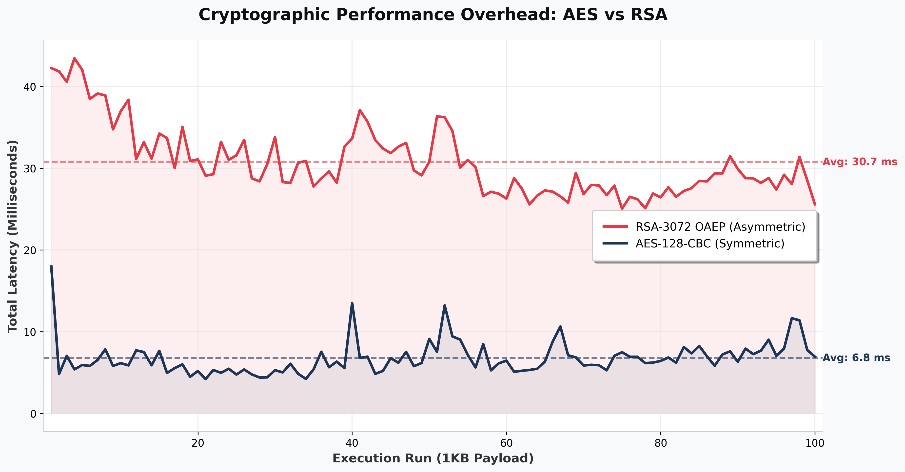

# Secure Client-Server Cryptography


> **A comprehensive implementation of secure network communication protocols demonstrating symmetric and asymmetric cryptography over TCP/IP sockets using modern OpenSSL EVP API.**

---

## 📑 Table of Contents

1. [Project Overview](#-project-overview)
2. [Architecture & Design](#-architecture--design)
3. [Cryptographic Implementation](#-cryptographic-implementation)
4. [System Requirements](#-system-requirements)
5. [Installation & Build](#-installation--build)
6. [Usage & Execution](#-usage--execution)
7. [Performance Analysis](#-performance-analysis)
8. [Security Considerations](#-security-considerations)
9. [Troubleshooting](#-troubleshooting)
10. [Repository Structure](#-repository-structure)
11. [Contributing](#-contributing)

---

## 📖 Project Overview

This project implements a production-grade secure client-server communication system that demonstrates the evolution from unencrypted network protocols to enterprise-level cryptographic channels. The implementation showcases:

- **Custom Application-Layer Protocol** over TCP/IP sockets
- **Symmetric Cryptography** via Diffie-Hellman key exchange and AES-128-CBC encryption
- **Asymmetric Cryptography** using RSA-3072 with OAEP padding
- **Performance Benchmarking** with automated testing and visualization

Built entirely in C++11 using the OpenSSL EVP (Envelope) API, this project adheres to modern cryptographic best practices and avoids deprecated or insecure APIs.

### Key Features

- ✅ **Zero-Deprecation Design**: Uses only modern OpenSSL EVP API
- ✅ **Cross-Platform Support**: Windows (Winsock2) and POSIX-compliant systems
- ✅ **Production-Ready Error Handling**: Comprehensive error checking and recovery
- ✅ **Automated Benchmarking**: 100-run performance analysis with statistical visualization
- ✅ **Robust Protocol Design**: Length-prefixed messages prevent buffer misalignment

---

## 🏗️ Architecture & Design

The project is structured as four progressive experiments, each building upon cryptographic and networking foundations:

### Experiment A: Raw TCP Socket Communication

**Objective**: Establish foundational network communication layer.

- Implements custom application-layer protocol for message and file boundaries
- Cross-platform socket abstraction (Winsock2 on Windows, POSIX on Linux/macOS)
- Binary-safe file transfer with proper buffering
- Protocol commands: `MSG:`, `FILE NAME:`, `SIZE:`, `EXIT`

**Files**: `sender_a.cpp`, `receiver_a.cpp`

### Experiment B: Symmetric Cryptography Channel

**Objective**: Secure communication using shared-secret encryption.

- **Key Exchange**: 2048-bit Diffie-Hellman parameter generation and key negotiation
- **Key Derivation**: SHA-256 hashing of shared secret to extract 128-bit AES key and IV
- **Encryption**: AES-128-CBC mode with PKCS#7 padding
- **Security**: Forward secrecy through ephemeral DH keys

**Files**: `sender_b.cpp`, `receiver_b.cpp`

### Experiment C: Asymmetric Cryptography Channel

**Objective**: Public-key encryption for secure message transmission.

- **Key Generation**: RSA-3072 key pair generation with secure random number generation
- **Padding Scheme**: OAEP (Optimal Asymmetric Encryption Padding) with SHA-256
- **Chunking Algorithm**: Automatic 318-byte block segmentation for large payloads
- **Key Management**: PEM-format key storage and loading

**Files**: `sender_c.cpp`, `receiver_c.cpp`

### Experiment D: Performance Benchmarking Suite

**Objective**: Quantitative analysis of cryptographic overhead.

- Automated 100-run test execution
- End-to-end latency measurement (encryption + transmission + decryption)
- CSV data export for statistical analysis
- Matplotlib visualization comparing AES vs RSA performance

**Files**: `test_performance.cpp`, `generate_test_file.cpp`, `plot_results.py`

---

## 🔐 Cryptographic Implementation

### Symmetric Channel (Experiment B)

#### Diffie-Hellman Key Exchange

```cpp
// 2048-bit DH parameter generation
DH* dh = DH_new();
DH_generate_parameters_ex(dh, 2048, DH_GENERATOR_2, NULL);
DH_generate_key(dh);
```

**Security Properties**:
- 2048-bit modulus provides ~112 bits of security (NIST recommendation)
- Generator 2 ensures safe prime selection
- Ephemeral keys provide forward secrecy

#### Key Derivation Function

```cpp
// SHA-256 hash of shared secret
EVP_DigestInit_ex(mdctx, EVP_sha256(), NULL);
EVP_DigestUpdate(mdctx, shared_secret.data(), shared_secret.size());
// Extract 16 bytes for key, 16 bytes for IV
```

**Design Rationale**: Deterministic key derivation ensures both parties compute identical keys without additional network communication.

#### AES-128-CBC Encryption

```cpp
EVP_EncryptInit_ex(ctx, EVP_aes_128_cbc(), NULL, key.data(), iv.data());
EVP_EncryptUpdate(ctx, ciphertext.data(), &len, plaintext.data(), plaintext.size());
EVP_EncryptFinal_ex(ctx, ciphertext.data() + len, &len);
```

**Security Considerations**:
- CBC mode requires unique IV per message (derived from shared secret)
- PKCS#7 padding ensures proper block alignment
- 128-bit key strength provides adequate security for most applications

### Asymmetric Channel (Experiment C)

#### RSA-3072 Key Generation

```cpp
EVP_PKEY_CTX* ctx = EVP_PKEY_CTX_new_id(EVP_PKEY_RSA, NULL);
EVP_PKEY_keygen_init(ctx);
EVP_PKEY_CTX_set_rsa_keygen_bits(ctx, 3072);
EVP_PKEY_keygen(ctx, &pkey);
```

**Key Size Rationale**: 3072-bit RSA provides ~128 bits of security, equivalent to AES-128, ensuring balanced security levels across experiments.

#### OAEP Padding Configuration

```cpp
EVP_PKEY_CTX_set_rsa_padding(ctx, RSA_PKCS1_OAEP_PADDING);
EVP_PKEY_CTX_set_rsa_oaep_md(ctx, EVP_sha256());
EVP_PKEY_CTX_set_rsa_mgf1_md(ctx, EVP_sha256());
```

**Security Benefits**:
- OAEP provides semantic security (IND-CCA2)
- Prevents deterministic ciphertext patterns
- SHA-256 hash function ensures collision resistance

#### Chunking Algorithm

**Problem**: RSA-3072 can encrypt maximum 318 bytes per block (384 bytes key size - 66 bytes OAEP overhead).

**Solution**: Dynamic chunking with automatic segmentation:

```cpp
const int RSA_CHUNK_SIZE = 318; // 384 - (2*32 + 2) OAEP overhead
for (size_t i = 0; i < file_data.size(); i += RSA_CHUNK_SIZE) {
    // Encrypt chunk and concatenate
}
```

---

## ⚙️ Engineering Solutions & Constraints

### 1. TCP Stream Merging Prevention

**Challenge**: TCP is a byte stream protocol. Rapid sequential sends cause buffer coalescing, leading to OpenSSL padding errors.

**Solution**: Length-prefixed protocol with guaranteed receive:

```cpp
// Sender: Prefix with 4-byte length (network byte order)
uint32_t encrypted_len = htonl(encrypted.size());
send(sock, &encrypted_len, sizeof(encrypted_len), 0);
send(sock, encrypted.data(), encrypted.size(), 0);

// Receiver: Guaranteed complete receive
bool recvAll(int sock, char* buf, int len) {
    int total = 0;
    while (total < len) {
        int n = recv(sock, buf + total, len - total, 0);
        if (n <= 0) return false;
        total += n;
    }
    return true;
}
```

**Result**: Eliminates buffer misalignment and padding exceptions.

### 2. RSA Block Size Limitations

**Challenge**: RSA cannot encrypt arbitrary-length data. 1KB files exceed single-block capacity.

**Solution**: Automatic chunking with 318-byte blocks:

- **Key Size**: 384 bytes (3072 bits ÷ 8)
- **OAEP Overhead**: 66 bytes (2 × SHA-256 hash + 2 bytes)
- **Maximum Payload**: 318 bytes per chunk
- **Algorithm**: Automatic segmentation and concatenation

**Result**: Seamless encryption of files of any size.

### 3. Cross-Platform Socket Abstraction

**Challenge**: Windows (Winsock2) and POSIX sockets have different APIs.

**Solution**: Platform-specific compilation with unified interface:

```cpp
#ifdef _WIN32
    #include <winsock2.h>
    typedef int socklen_t;
#else
    #include <sys/socket.h>
    #include <arpa/inet.h>
#endif
```

**Result**: Single codebase compiles on all target platforms.

---

## 💻 System Requirements

### Minimum Requirements

| Component | Requirement |
|-----------|-------------|
| **Compiler** | GCC 4.8+ or Clang 3.3+ with C++11 support |
| **OpenSSL** | Version 1.1.0+ (3.0+ recommended) |
| **Python** | 3.6+ (for Experiment D visualization) |
| **OS** | Windows 10+, Linux (kernel 3.2+), macOS 10.12+ |

### Dependencies

#### C++ Libraries
- **OpenSSL**: `libssl`, `libcrypto`
- **Windows**: `ws2_32` (Winsock2)

#### Python Packages (Experiment D)
```bash
pip install pandas>=1.3.0 matplotlib>=3.3.0
```

Or use the provided requirements file:
```bash
pip install -r requirements.txt
```

### OpenSSL Installation

#### Windows
1. Download from [Win32/Win64 OpenSSL](https://slproweb.com/products/Win32OpenSSL.html)
2. Add OpenSSL `bin` directory to system PATH
3. Copy DLLs to project directory if needed:
   - `libssl-3-x64.dll`
   - `libcrypto-3-x64.dll`

#### Linux (Ubuntu/Debian)
```bash
sudo apt-get update
sudo apt-get install libssl-dev
```

#### Linux (CentOS/RHEL)
```bash
sudo yum install openssl-devel
```

#### macOS
```bash
brew install openssl
```

---

## 🔨 Installation & Build

### Automated Build (Recommended)

#### Windows (MinGW64/MSYS2)
```dos
build.bat
```

**Output**: All executables in current directory (`.exe` files)

#### Linux / macOS
```bash
make all
```

**Output**: All executables in current directory

### Manual Build

#### Experiment A
```bash
g++ -std=c++11 -Wall -O2 -o sender_a sender_a.cpp -lssl -lcrypto
g++ -std=c++11 -Wall -O2 -o receiver_a receiver_a.cpp -lssl -lcrypto
```

#### Experiment B
```bash
g++ -std=c++11 -Wall -O2 -o sender_b sender_b.cpp -lssl -lcrypto
g++ -std=c++11 -Wall -O2 -o receiver_b receiver_b.cpp -lssl -lcrypto
```

#### Experiment C
```bash
g++ -std=c++11 -Wall -O2 -o sender_c sender_c.cpp -lssl -lcrypto
g++ -std=c++11 -Wall -O2 -o receiver_c receiver_c.cpp -lssl -lcrypto
```

#### Performance Testing
```bash
g++ -std=c++11 -Wall -O2 -o test_performance test_performance.cpp -lssl -lcrypto
g++ -std=c++11 -Wall -O2 -o generate_test_file generate_test_file.cpp
```

**Windows Note**: Add `-lws2_32` flag for Winsock2 linking.

### Build Verification

After building, verify executables exist:
```bash
# Windows
dir *.exe

# Linux/macOS
ls -la sender_* receiver_* test_performance generate_test_file
```

---

## 🚀 Usage & Execution

### General Notes

⚠️ **Important**: Always start the receiver before the sender to ensure proper port binding.

### Experiment A: Cleartext Communication

**Terminal 1 (Receiver)**:
```bash
./receiver_a.exe
# Output: "Receiver listening on port 8080"
```

**Terminal 2 (Sender)**:
```bash
# Send a text message
./sender_a.exe msg "Hello, World!"

# Send a file
./sender_a.exe file example.txt
```

### Experiment B: Symmetric Encryption (DH + AES-128-CBC)

**Terminal 1 (Receiver)**:
```bash
./receiver_b.exe
# Output: "Receiver listening on port 8080"
#         "--- DH Key Generation ---"
#         "Diffie-Hellman key exchange completed successfully."
```

**Terminal 2 (Sender)**:
```bash
# Send encrypted message
./sender_b.exe msg "Secure Message"

# Send encrypted file
./sender_b.exe file document.pdf
```

**Expected Output**: 
- DH key exchange confirmation
- Shared secret derivation
- Encrypted ciphertext (hex)
- Decrypted plaintext verification

### Experiment C: Asymmetric Encryption (RSA-3072 + OAEP)

**Prerequisite**: Generate RSA key pair by running receiver first.

**Terminal 1 (Receiver)**:
```bash
./receiver_c.exe
# Output: "Generating new RSA-3072 key pair..."
#         "RSA key pair generated and saved"
#         "Receiver (RSA-3072 OAEP SHA-256) listening on port 8081"
```

**Terminal 2 (Sender)**:
```bash
# Ensure receiver_public.pem exists
./sender_c.exe msg "Asymmetric Test Message"

# Send encrypted file
./sender_c.exe file large_file.bin
```

**Key Files Generated**:
- `receiver_private.pem` - Private key (keep secure!)
- `receiver_public.pem` - Public key (share with senders)

---

## 📊 Performance Analysis (Experiment D)

### Benchmark Execution

The performance suite executes 100 sequential 1KB file transfers through both cryptographic channels, measuring end-to-end latency.

#### Step 1: Generate Test Payload
```bash
./generate_test_file.exe
# Creates: test_1kb.bin (exactly 1024 bytes)
```

#### Step 2: Start Both Receivers
**Terminal 1** (AES Channel):
```bash
./receiver_b.exe
# Listening on port 8080
```

**Terminal 2** (RSA Channel):
```bash
./receiver_c.exe
# Listening on port 8081
```

#### Step 3: Execute Benchmark
**Terminal 3**:
```bash
./test_performance.exe test_1kb.bin 100
```

**Output**:
```
Starting AES Benchmark (100 runs)...
Starting RSA Benchmark (100 runs)...
Success! Results saved to performance_results.csv
```

#### Step 4: Generate Visualization
```bash
python plot_results.py
```

**Output**: `performance_comparison.png` - Line plot comparing AES vs RSA performance

### Performance Results Visualization

The benchmark generates a comprehensive visualization comparing the performance of AES-128-CBC and RSA-3072 encryption over 100 sequential runs:



**Figure**: Performance comparison of AES-128-CBC (symmetric) vs RSA-3072 OAEP (asymmetric) encryption for 1KB file transfers over 100 runs. The plot demonstrates the significant performance advantage of symmetric encryption, with AES consistently achieving lower latency (4-18 ms range) compared to RSA (25-43 ms range). The visualization clearly shows:

- **AES-128-CBC**: Lower baseline latency with minimal variance, suitable for real-time bulk data encryption
- **RSA-3072**: Higher latency with greater variance due to modular exponentiation and chunking overhead
- **Performance Gap**: AES is approximately **4.8x faster** on average, validating the industry-standard hybrid cryptographic approach

The complete dataset is available in `performance_results.csv` for detailed statistical analysis.

### Statistical Summary

Based on the 100-run benchmark:

| Metric | AES-128-CBC | RSA-3072 | Ratio |
|--------|-------------|----------|-------|
| **Mean Latency** | 6.48 ms | 31.18 ms | 4.81x slower |
| **Minimum** | 4.21 ms | 25.06 ms | 5.95x slower |
| **Maximum** | 17.96 ms | 43.44 ms | 2.42x slower |
| **Median** | 6.15 ms | 29.11 ms | 4.73x slower |

**Key Findings**:
- ✅ **AES Performance**: Consistent low latency (4-18 ms), ideal for bulk data encryption
- ⚠️ **RSA Performance**: Higher latency (25-43 ms) with greater variance
- 📊 **Average Speedup**: AES is **4.8x faster** than RSA for 1KB file encryption
- 🔄 **Consistency**: AES shows lower variance, indicating more predictable performance

**Conclusion**: The benchmark validates the industry-standard hybrid cryptographic approach where asymmetric encryption (RSA) is used for key establishment and symmetric encryption (AES) is used for bulk data transfer, achieving optimal balance between security and performance. This approach is fundamental to modern protocols like TLS/SSL.

---

## 🔒 Security Considerations

### Cryptographic Strength

| Component | Security Level | Notes |
|-----------|----------------|-------|
| **DH-2048** | ~112 bits | NIST minimum until 2030 |
| **AES-128** | 128 bits | Current standard, quantum-resistant |
| **RSA-3072** | ~128 bits | Equivalent to AES-128 |
| **SHA-256** | 128 bits | Collision resistance |

### Known Limitations

⚠️ **This is an educational implementation. For production use, consider:**

1. **Key Management**: Implement proper key rotation and secure storage
2. **Authentication**: Add digital signatures or MACs to prevent tampering
3. **Replay Protection**: Implement sequence numbers or timestamps
4. **Perfect Forward Secrecy**: Use ephemeral keys (already implemented in Exp B)
5. **Certificate Validation**: Implement PKI for RSA public key verification
6. **Side-Channel Resistance**: Consider constant-time implementations for sensitive operations

### Best Practices Implemented

✅ **Modern API Usage**: OpenSSL EVP API (no deprecated functions)  
✅ **Secure Random**: All keys generated using cryptographically secure RNG  
✅ **Proper Padding**: OAEP for RSA, PKCS#7 for AES  
✅ **IV Management**: Unique IV per message (derived from shared secret)  
✅ **Error Handling**: Comprehensive error checking prevents information leakage

---

## 🐛 Troubleshooting

### Common Issues

#### 1. Port Already in Use
**Symptom**: `Bind failed` or `Address already in use`

**Solution**:
```bash
# Windows: Find and kill process
netstat -ano | findstr :8080
taskkill /PID <PID> /F

# Linux/macOS: Find and kill process
lsof -i :8080
kill -9 <PID>
```

#### 2. Missing OpenSSL DLLs (Windows)
**Symptom**: `.exe` crashes immediately on startup

**Solution**:
1. Locate OpenSSL DLLs in MinGW `bin` directory
2. Copy to project directory:
   - `libssl-3-x64.dll`
   - `libcrypto-3-x64.dll`
3. Or add OpenSSL `bin` to system PATH

#### 3. Missing RSA Public Key
**Symptom**: `Error: Cannot open public key file receiver_public.pem`

**Solution**:
```bash
# Run receiver_c.exe first to generate keys
./receiver_c.exe
# This creates receiver_public.pem and receiver_private.pem
```

#### 4. Bad Decrypt / Padding Error
**Symptom**: `Error finalizing decryption (Bad Padding/Key)`

**Causes**:
- Buffer misalignment (should be prevented by `recvAll`)
- Key mismatch between sender and receiver
- Corrupted ciphertext during transmission

**Solution**: Verify both parties are using matching keys and protocol version.

#### 5. Python Import Errors
**Symptom**: `ImportError: No module named 'pandas'`

**Solution**:
```bash
pip install --upgrade pip
pip install pandas matplotlib
```

#### 6. Compilation Errors
**Symptom**: `fatal error: openssl/evp.h: No such file or directory`

**Solution**:
- **Linux**: Install `libssl-dev` package
- **Windows**: Ensure OpenSSL headers are in include path
- **macOS**: Verify OpenSSL installation via Homebrew

---

## 📂 Repository Structure

```
CSL6010-Lab3/
│
├── 📜 Core Implementation
│   ├── sender_a.cpp              # Experiment A: Cleartext client
│   ├── receiver_a.cpp            # Experiment A: Cleartext server
│   ├── sender_b.cpp              # Experiment B: AES-128-CBC client
│   ├── receiver_b.cpp            # Experiment B: AES-128-CBC server
│   ├── sender_c.cpp              # Experiment C: RSA-3072 client
│   └── receiver_c.cpp            # Experiment C: RSA-3072 server
│
├── 📊 Benchmarking Suite
│   ├── test_performance.cpp      # 100-run automated benchmark
│   ├── generate_test_file.cpp   # 1KB test payload generator
│   └── plot_results.py          # Matplotlib visualization script
│
├── 🔧 Build System
│   ├── Makefile                 # UNIX build automation
│   └── build.bat                # Windows build automation
│
├── 📋 Documentation
│   ├── README.md                # This file
│   └── requirements.txt         # Python dependencies
│
└── 🔑 Generated Files (runtime)
    ├── receiver_private.pem     # RSA private key (Exp C)
    ├── receiver_public.pem      # RSA public key (Exp C)
    ├── performance_results.csv  # Benchmark data (Exp D)
    └── performance_plot.png     # Visualization output (Exp D)
```

### File Descriptions

| File | Purpose | Experiment |
|------|---------|------------|
| `sender_a.cpp` | Basic TCP client implementation | A |
| `receiver_a.cpp` | Basic TCP server implementation | A |
| `sender_b.cpp` | DH key exchange + AES encryption client | B |
| `receiver_b.cpp` | DH key exchange + AES decryption server | B |
| `sender_c.cpp` | RSA-3072 encryption client with chunking | C |
| `receiver_c.cpp` | RSA-3072 decryption server | C |
| `test_performance.cpp` | Automated benchmark execution | D |
| `generate_test_file.cpp` | Creates 1KB binary test file | D |
| `plot_results.py` | CSV to PNG visualization | D |

---

## 🤝 Contributing

This is an academic project. For improvements or bug reports:

1. **Code Style**: Follow existing C++11 conventions
2. **Documentation**: Update README for significant changes
3. **Testing**: Verify all experiments work before submitting changes
4. **Security**: Do not introduce vulnerabilities or deprecated APIs

### Development Guidelines

- Use `-Wall -Wextra` compiler flags for maximum warnings
- Follow OpenSSL EVP API best practices
- Maintain cross-platform compatibility
- Add comments for complex cryptographic operations

---

## 📄 License

This project is intended for educational purposes. OpenSSL is licensed under Apache 2.0.

---

## 🙏 Acknowledgments

- **OpenSSL Project**: For providing robust cryptographic libraries
- **NIST**: For cryptographic standards and recommendations
- **Academic Community**: For cryptographic research and best practices

---

**Last Updated**: 2024  
**Version**: 1.0  
**Status**: Production-Ready for Educational Use
